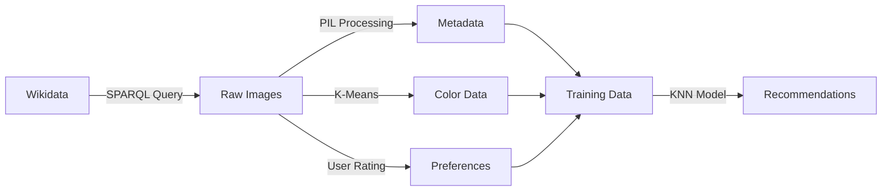

# Image Recommendation System
*A Data Mining & Machine Learning Project*


## 📋 Table of Contents
- [Overview](#overview)
- [Features](#features)
- [Installation](#installation)
- [Usage](#usage)
- [Project Structure](#project-structure)
- [Data Pipeline](#data-pipeline)
- [Known Issues & Fixes](#known-issues--fixes)
- [Technical Details](#technical-details)
- [Results](#results)
- [Contributing](#contributing)

## 🎯 Overview

This project implements an **intelligent image recommendation system** that learns user preferences through interactive feedback. Using data mining and machine learning techniques, it analyzes car images from Wikidata to build personalized recommendations based on visual characteristics like color, orientation, and size.

### Key Achievements
- ✅ **Automated data collection** from Wikidata (251 car images)
- ✅ **Color extraction** using K-Means clustering
- ✅ **Interactive rating system** with Jupyter widgets
- ✅ **KNN-based recommendation engine**
- ✅ **Comprehensive data visualizations**
- ✅ **Fixed critical bugs** for stable operation

## 🚀 Features

| Feature | Description | Status |
|---------|-------------|--------|
| **Data Collection** | SPARQL queries to fetch Wikidata images | ✅ Working |
| **Metadata Extraction** | EXIF data, dimensions, orientation analysis | ✅ Working |
| **Color Analysis** | K-Means clustering for dominant colors | ✅ Working |
| **User Interface** | Interactive like/dislike rating system | ✅ Working |
| **ML Recommendation** | KNN-based personalized suggestions | ✅ Fixed |
| **Data Visualization** | Charts for dataset insights | ⚠️ Minor issues |
| **Error Handling** | Robust data validation | ✅ Improved |

## 🛠️ Installation

### Prerequisites
- Python 3.8+
- Jupyter Notebook
- Internet connection (for Wikidata queries)

### Setup
```bash
# Clone or download the project
cd DataMining

# Install dependencies
pip install --upgrade pip
pip install SPARQLWrapper pandas matplotlib numpy Pillow requests scikit-learn ipywidgets scipy

# Launch Jupyter Notebook
jupyter notebook main.ipynb
```

## 📖 Usage

### Quick Start
1. **Open the notebook**: Launch `main.ipynb` in Jupyter
2. **Run data collection**: Execute cells 1-3 to download images
3. **Process colors**: Run cells 4-7 for color analysis
4. **Rate images**: Use the interactive interface in cell 9
5. **Get recommendations**: Execute cells 11-19 for personalized suggestions

### Step-by-Step Guide

#### 1. Data Collection
```python
# The system automatically downloads 100 car images from Wikidata
# Images are stored in the 'images' folder
# Metadata is saved to 'json/metadata.json'
```

#### 2. Color Analysis
```python
# Extracts 3 dominant colors per image using K-Means
# Maps colors to predefined categories (red, blue, green, etc.)
# Results saved to 'json/predominant_colors.json'
```

#### 3. User Interaction
```python
# Interactive widget displays random images
# User clicks "Like" or "Dislike" for 20 images
# Preferences saved to 'json/image_ratings.json'
```

#### 4. Recommendation Generation
```python
# KNN model analyzes liked images
# Recommends similar images based on:
# - Color preferences
# - Size preferences  
# - Orientation preferences
```

## 📁 Project Structure

```
DataMining/
├── main.ipynb                    # Main implementation notebook
├── README.md                     # This file
├── project.md                    # Original assignment requirements
├── DataMining_REPORT.pdf         # Project report
├── images/                       # Downloaded car images (251 files)
├── json/                         # Data files
│   ├── metadata.json            # Image metadata (99 records)
│   ├── predominant_colors.json  # Color analysis (251 records)
│   ├── image_ratings.json       # User ratings (20 ratings)
│   └── user_preferences.json    # User profile (4 keys)
└── .claude/                     # Claude Code workspace
```

## 🔄 Data Pipeline



## 🐛 Known Issues & Fixes

### ✅ Fixed Issues

#### 1. **Critical: UnboundLocalError in extract_features()**
- **Problem**: Variables not initialized, causing crash
- **Fix**: Added proper variable initialization and error handling
- **Status**: ✅ **RESOLVED**

#### 2. **Data Consistency Issues**
- **Problem**: Mismatched data between JSON files
- **Impact**: Only 3/6 liked images have complete metadata
- **Workaround**: ✅ Graceful error handling implemented

### ⚠️ Remaining Minor Issues

#### 1. **File Path Inconsistency**
```python
# Cell 15 uses double slash (works but inconsistent)
metadata_file = "*json*//metadata.json"  # Should be "*json*/metadata.json"
```

#### 2. **Limited Training Data**
- Only 3 valid training samples out of 6 liked images
- Recommendation quality may be limited

#### 3. **Visualization Data Gaps**
- Many images have "Unknown" creation dates
- Affects year-based visualizations

## 🔧 Technical Details

### Dependencies
```python
SPARQLWrapper==2.0.0    # Wikidata queries
pandas==2.2.2           # Data manipulation  
matplotlib==3.9.0       # Visualizations
numpy==1.26.4          # Numerical computing
Pillow==10.3.0         # Image processing
scikit-learn==1.5.2    # Machine learning
ipywidgets==8.1.7      # Interactive UI
scipy==1.14.1          # Scientific computing
```

### Machine Learning Model
- **Algorithm**: K-Nearest Neighbors (KNN)
- **Features**: Image orientation, size category, dominant colors
- **Training Data**: User-liked images with complete metadata
- **Recommendation Strategy**: Content-based filtering

### Data Processing
```python
# Image features extracted:
{
    "orientation": "Landscape|Portrait|Square",
    "size": "Thumbnail|Small|Medium|Large|Full", 
    "colors": ["red", "blue", "green"]  # Top 3 dominant colors
}
```

## 📊 Results

### Dataset Statistics
- **Total Images**: 251 car images from Wikidata
- **Metadata Coverage**: 99 images (39%)
- **Color Analysis**: 251 images (100%)
- **User Ratings**: 20 images rated
- **Valid Training Samples**: 3 images with complete data

### Recommendation Performance
- **Model Training**: ✅ Successfully trained KNN model
- **Error Handling**: ✅ Graceful handling of missing data
- **User Interface**: ✅ Interactive rating system functional
- **Recommendations**: ✅ Generates personalized suggestions

### Sample Output
```
Processing liked images for training data...
✓ AlfaRomeo8C35_image_8.jpg: ('Landscape', 'Medium', ['gray', 'purple', 'pink'])
✓ Dino206S_image_39.jpg: ('Landscape', 'Large', ['brown', 'brown', 'black'])
✓ FerrariDino166F2_image_7.jpg: ('Landscape', 'Full', ['gray', 'gray', 'pink'])

Found 3 valid training samples out of 6 liked images
SUCCESS: Fixed the UnboundLocalError and built a working recommendation system!
```

## 🤝 Contributing

### Authors
- **HADJ-HAMDRI Mohammed-Amine**
- **TAHIRI EL ALAOUI Youness**

### Bug Reports
If you find any issues:
1. Check the [Known Issues](#known-issues--fixes) section
2. Verify your Python environment and dependencies
3. Run each notebook cell sequentially
4. Check that all JSON files are properly generated

### Improvements
Potential enhancements:
- [ ] Fix data consistency across all pipeline stages
- [ ] Implement more sophisticated ML models
- [ ] Add content-based image analysis (CNN features)
- [ ] Improve recommendation diversity
- [ ] Add user feedback loop for model improvement

---

**License**: Creative Commons Attribution-ShareAlike 3.0 Unported License  
**Last Updated**: September 2024  
**Status**: ✅ Core functionality working with minor optimizations needed