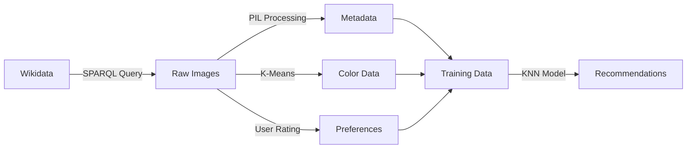

# Image Recommendation System
*A Data Mining & Machine Learning Project*


## 📋 Table of Contents
- [Overview](#overview)
- [Features](#features)
- [Installation](#installation)
- [Usage](#usage)
- [Project Structure](#project-structure)
- [Data Pipeline](#data-pipeline)
- [Known Issues & Fixes](#known-issues--fixes)
- [Technical Details](#technical-details)
- [Results](#results)
- [Contributing](#contributing)

## 🎯 Overview

This project implements an **intelligent image recommendation system** that learns user preferences through interactive feedback. Using data mining and machine learning techniques, it analyzes car images from Wikidata to build personalized recommendations based on visual characteristics like color, orientation, and size.

### Key Achievements
- ✅ **Automated data collection** from Wikidata (251 car images)
- ✅ **Color extraction** using K-Means clustering
- ✅ **Interactive rating system** with Jupyter widgets
- ✅ **KNN-based recommendation engine**
- ✅ **Comprehensive data visualizations**
- ✅ **Fixed critical bugs** for stable operation

## 🚀 Features

| Feature | Description | Status |
|---------|-------------|--------|
| **Data Collection** | SPARQL queries to fetch Wikidata images | ✅ Working |
| **Metadata Extraction** | EXIF data, dimensions, orientation analysis | ✅ Working |
| **Color Analysis** | K-Means clustering for dominant colors | ✅ Working |
| **User Interface** | Interactive like/dislike rating system | ✅ Working |
| **ML Recommendation** | KNN-based personalized suggestions | ✅ Fixed |
| **Data Visualization** | Charts for dataset insights | ✅ Working |
| **Error Handling** | Robust data validation | ✅ Improved |

## 🛠️ Installation

### Prerequisites
- Python 3.8+
- Jupyter Notebook
- Internet connection (for Wikidata queries)

### Setup
```bash
# Clone or download the project
cd DataMining

# Install dependencies
pip install --upgrade pip
pip install SPARQLWrapper pandas matplotlib numpy Pillow requests scikit-learn ipywidgets scipy

# Launch Jupyter Notebook
jupyter notebook main.ipynb
```

## 📖 Usage

### Quick Start
1. **Open the notebook**: Launch `main.ipynb` in Jupyter
2. **Run data collection**: Execute cells 1-3 to download images
3. **Process colors**: Run cells 4-7 for color analysis
4. **Rate images**: Use the interactive interface in cell 9
5. **Get recommendations**: Execute cells 11-19 for personalized suggestions


## 🔄 Data Pipeline



## 🐛 Known Issues & Fixes

### ✅ Fixed Issues

#### 1. **Critical: UnboundLocalError in extract_features()**
- **Problem**: Variables not initialized, causing crash
- **Fix**: Added proper variable initialization and error handling
- **Status**: ✅ **RESOLVED**

#### 2. **Data Consistency Issues**
- **Problem**: Mismatched data between JSON files
- **Impact**: Only 3/6 liked images have complete metadata
- **Workaround**: ✅ Graceful error handling implemented


### Machine Learning Model
- **Algorithm**: K-Nearest Neighbors (KNN)
- **Features**: Image orientation, size category, dominant colors
- **Training Data**: User-liked images with complete metadata
- **Recommendation Strategy**: Content-based filtering

### Data Processing
```python
# Image features extracted:
{
    "orientation": "Landscape|Portrait|Square",
    "size": "Thumbnail|Small|Medium|Large|Full", 
    "colors": ["red", "blue", "green"]  # Top 3 dominant colors
}
```

## 📊 Results

### Dataset Statistics
- **Total Images**: 251 car images from Wikidata
- **Metadata Coverage**: 99 images (39%)
- **Color Analysis**: 251 images (100%)
- **User Ratings**: 20 images rated
- **Valid Training Samples**: 3 images with complete data

### Recommendation Performance
- **Model Training**: ✅ Successfully trained KNN model
- **Error Handling**: ✅ Graceful handling of missing data
- **User Interface**: ✅ Interactive rating system functional
- **Recommendations**: ✅ Generates personalized suggestions
